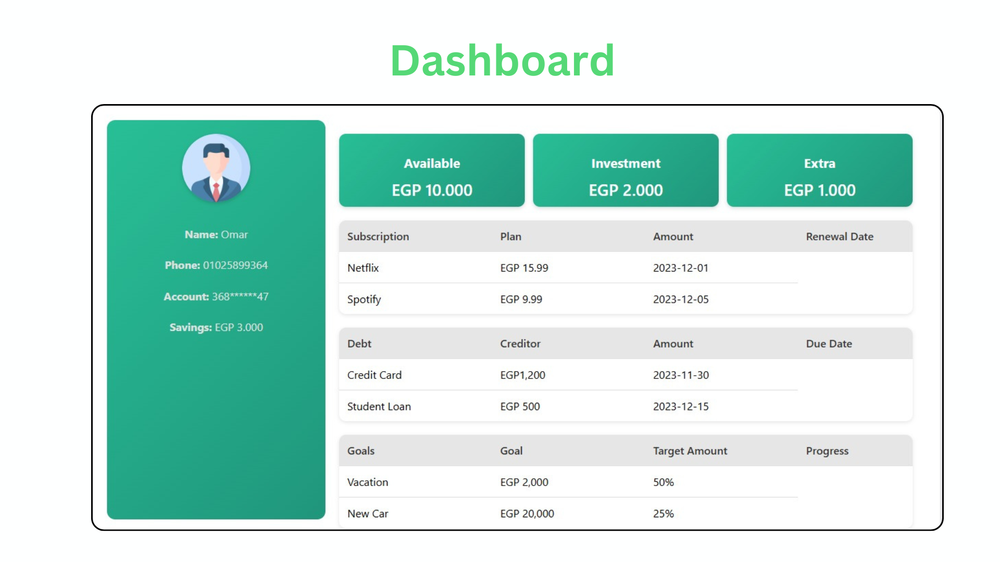

# AI Financial Assistant

## Overview

The AI Financial Assistant is an intelligent agent-based system designed to help users manage their financials effectively. Leveraging AI Agent technology and Large Language Models (LLMs), the system assists users suffering from "Money Disorders" in organizing their expenses, subscriptions, debts, and financial goals while also providing personalized financial advice. The AI is deployed on a website, where it monitors user financial activity and acts based on predefined tasks.

## Features

1. **Expense Management** - Organizes user expenses and allocates income into categories such as Available, Investment, Entertainment, and Saving.
2. **Subscription Management** - Tracks and prioritizes user subscriptions while calculating the total monthly subscription cost.
3. **Debt Management** - Monitors debts, plans debt repayment schedules, and integrates debt impact into the overall financial plan.
4. **Financial Goal Management** - Analyzes user finances and structures a savings plan to help achieve financial goals efficiently.
5. **Personalized Financial Advice** - Offers tailored financial recommendations based on user financial habits and resources.
6. **Task Execution Management** - Coordinates and delegates tasks between financial management agents to ensure seamless execution and updates.

## AI Agents Architecture

The system comprises six AI agents, each responsible for a specific financial function:

### 1. **Main Expenses Management Agent**

- Divides the user's total income based on expenses, debts, and subscriptions.
- Generates a structured JSON file containing expense categories: Available, Investment, Entertainment, and Saving.

### 2. **Subscription Management Agent**

- Tracks all user subscriptions and calculates total monthly costs.
- Prioritizes subscriptions based on user preferences.

### 3. **Debt Management Agent**

- Monitors and records user debts.
- Creates a structured JSON file containing debt name, amount, and a monthly repayment plan.

### 4. **Financial Goal Management Agent**

- Evaluates available balance, investable money, and financial goals.
- Generates a savings plan and provides a JSON file with goal-tracking details.

### 5. **Financial Advice Agent**

- Provides personalized financial recommendations based on user spending patterns and available resources.

### 6. **Manager Agent** (Orchestration Agent)

- Coordinates tasks among all agents.
- Ensures financial data consistency and updates between different agents.
- Delegates tasks based on user actions (e.g., adding a subscription, setting a financial goal).

## JSON File Outputs

Each agent produces structured JSON data to ensure transparency and trackability:

- **Main Expenses Management:** `{Available, Investment, Entertainment, Saving}`
- **Subscription Management:** `{Subscription Name, Cost, Priority Level}`
- **Debt Management:** `{Debt Name, Amount, Monthly Payment Plan}`
- **Financial Goal Management:** `{Goal, Required Monthly Savings, Progress}`

## Main Used Python Libraries

The project is built using the following main Python libraries:

```bash
pip install crewai pydantic typing json
```

- **crewai** - For building and managing AI agents.
- **pydantic** - For data validation and structured data management.
- **typing** - For type hinting and ensuring code clarity.
- **json** - For handling JSON data and file operations.

## Project File Structure

```
/financial_ai_assistant
│── Agent.py       # Defines AI Agents
│── Tasks.py       # Contains tasks executed by AI Agents
│── app.py         # Main application entry point
│── README.md      # Project documentation
```

## Deployment

The AI Financial Assistant is deployed on a website and integrates seamlessly with user financial data. It monitors usage patterns, processes predefined tasks upon request, and ensures users receive accurate, actionable financial insights.




## Future Enhancements

- **AI-Driven Budget Optimization**: Adaptive budgeting based on real-time spending patterns.
- **Predictive Financial Insights**: Forecasting financial trends and expenses.
- **Integration with Banking APIs**: Direct financial tracking and automation.

## Conclusion

This AI-powered financial assistant aims to help users manage their money disorders efficiently, offering structured financial planning, debt management, and personalized financial advice. By leveraging AI-driven automation, users can gain greater control over their financial well-being.